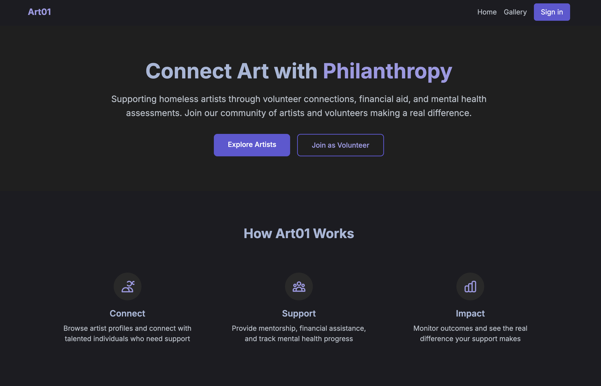

# Art01: Art + Philanthropy Platform




An open-source platform connecting volunteers with homeless artists through mentorship, financial support, and mental health assessments.

[](https://opensource.org/licenses/MIT)
[](https://nextjs.org/)
[](https://www.typescriptlang.org/)
[](https://www.prisma.io/)

## 🌟 About

Art01 bridges the gap between creative talent and community support by:

- **Connecting artists with volunteers** for mentorship and practical help
- **Tracking program outcomes** including mental health assessments (PHQ-9, GAD-7)
- **Managing financial allocations** with transparent impact measurement
- **Providing data analytics** for program optimization
- **Supporting artist portfolio development** with static site generation

## 🚀 Features

### For Artists
- Create and manage artist profiles
- Showcase artwork portfolios
- Access mentorship opportunities
- Track progress and support received
- Export static portfolio websites

### For Volunteers
- Browse artist profiles and needs
- Log mentorship sessions and support
- Track time and financial contributions
- View program impact dashboards
- Connect with artists for meaningful help

### For Administrators
- Comprehensive analytics dashboard
- Mental health assessment tracking
- Financial impact measurement
- Export and reporting capabilities
- User management and security

### Technical Features
- **Real-time analytics** with interactive charts
- **Encrypted sensitive data** storage
- **Multi-provider authentication** (Email, GitHub OAuth)
- **Machine learning insights** for program optimization
- **Static site generation** for artist portfolios
- **RESTful API** with comprehensive documentation

## 🛠 Technology Stack

### Frontend
- **Next.js 14** - React framework with app directory
- **TypeScript** - Type-safe development
- **Tailwind CSS** - Utility-first styling
- **shadcn/ui** - Beautiful, accessible components
- **Recharts** - Interactive data visualizations
- **NextAuth.js** - Authentication and session management

### Backend
- **Next.js API Routes** - Full-stack TypeScript APIs
- **Prisma ORM** - Type-safe database access
- **SQLite/PostgreSQL** - Local-first database design
- **Zod** - Runtime type validation
- **FastAPI** - Python ML services

### DevOps & Tools
- **pnpm** - Fast, disk-efficient package manager
- **Docker** - Containerized ML services
- **ESLint/Prettier** - Code quality and formatting
- **Git hooks** - Automated quality checks

## 📋 Prerequisites

Before running Art01 locally, ensure you have:

- **Node.js 18+** and **pnpm** package manager
- **Python 3.11+** for ML services
- **SQLite3** for local database
- **Git** for version control

## 🚀 Quick Start

### 1. Clone the Repository
```bash
git clone https://github.com/kliewerdaniel/art04.git
cd art04
```

### 2. Automated Setup (Recommended)
```bash
# Run the automated setup script
./setup.sh
```

### 3. Manual Setup (Alternative)
```bash
# Install dependencies
cd apps/web
pnpm install

# Set up database
pnpm prisma generate
pnpm prisma db push

# Seed with sample data
pnpm tsx prisma/seed.ts
```

### 4. Start Development Server
```bash
cd apps/web
pnpm dev
```

### 5. Access the Application
- **Application**: http://localhost:3000
- **Database Browser**: http://localhost:5555 (run `pnpm prisma studio`)

## 🎯 What We've Built

Art01 is now a fully functional platform with:

### ✅ Completed Features
- **Modern UI**: Beautiful, responsive design with Tailwind CSS
- **Authentication**: Email-based auth with NextAuth.js
- **Artist Gallery**: Browse and view artist profiles
- **Database**: SQLite with Prisma ORM and sample data
- **API Routes**: Complete REST API for all operations
- **Charts & Analytics**: Interactive data visualizations
- **Automated Setup**: One-command installation and configuration

### 🎨 User Experience
- **Landing Page**: Engaging hero section with clear value proposition
- **Artist Cards**: Rich profiles with artwork counts and stats
- **Navigation**: Responsive design with mobile menu
- **Loading States**: Professional loading indicators and error handling
- **Session Management**: Seamless authentication flow

### 🔧 Developer Experience
- **TypeScript**: Full type safety throughout the application
- **Environment Config**: Comprehensive environment variable setup
- **Database Seeding**: Sample data for immediate testing
- **Error Handling**: Graceful error states and retry functionality

## 📊 Sample Data

Populate your local database with sample data:

```bash
# Import artists from CSV
node scripts/import-data.js --file data/sample-artists.csv --type csv --model artists

# Import sample assessments
node scripts/import-data.js --file data/sample-assessments.json --type json --model assessments
```

## 🏗 Project Structure

```
art01/
├── apps/web/                 # Next.js frontend application
│   ├── app/                  # App Router pages and API routes
│   ├── components/           # Reusable React components
│   │   └── charts/          # Analytics chart components
│   ├── lib/                  # Utilities and configurations
│   └── styles/               # Global styles and Tailwind config
├── ml-service/              # FastAPI machine learning service
│   ├── app.py               # Main API application
│   ├── requirements.txt     # Python dependencies
│   └── Dockerfile           # Container configuration
├── prisma/                  # Database schema and migrations
├── scripts/                 # Utility scripts for data management
└── docs/                    # Comprehensive documentation
```

## 🔧 Available Scripts

### Development
```bash
pnpm dev          # Start development server
pnpm build        # Build production bundle
pnpm start        # Start production server
pnpm lint         # Run ESLint
pnpm type-check   # Run TypeScript checks
```

### Database
```bash
pnpm prisma studio   # Open database browser
pnpm prisma migrate  # Run database migrations
pnpm prisma generate # Generate Prisma client
```

### Data Management
```bash
# Export artist portfolio
node scripts/export-artist.js --artistId <id> --output ./static-sites

# Import data
node scripts/import-data.js --file data.csv --type csv --model artists
```

## 📚 Documentation

- **[API Reference](./docs/api.md)** - Complete API documentation
- **[Deployment Guide](./docs/deployment.md)** - Hosting and deployment instructions
- **[Contributing Guide](./docs/contributing.md)** - Development workflow and standards
- **[Metrics Guide](./docs/metrics.md)** - Assessment and impact measurement
- **[Research Notes](./docs/research.md)** - Study design and findings

## 🔐 Security & Privacy

Art01 takes user privacy seriously:

- **Encrypted storage** of sensitive mental health assessment data
- **GDPR compliance** with data export capabilities
- **Minimal data collection** - only what's necessary for operations
- **Explicit consent** required for data usage
- **Secure authentication** with multiple providers

## 🤝 Contributing

We welcome contributions! Please see our [Contributing Guide](./docs/contributing.md) for:

- Development environment setup
- Code style and standards
- Pull request process
- Testing guidelines
- Community guidelines

### Areas for Contribution
- **UI/UX Improvements**: Enhanced artist/volunteer experience
- **Mobile Optimization**: Responsive design enhancements
- **Additional Assessments**: Support for new mental health tools
- **Advanced Analytics**: ML-driven insights and recommendations
- **Internationalization**: Multi-language support
- **Accessibility**: WCAG 2.1 compliance improvements

## 📈 Roadmap

### Q4 2024
- [ ] Real-time collaboration features
- [ ] Advanced ML recommendation engine
- [ ] Mobile app (React Native)
- [ ] Automated impact reporting

### Q1 2025
- [ ] Multi-organization support
- [ ] Integration with external services
- [ ] Advanced analytics dashboard
- [ ] Peer mentoring networks

### Future Enhancements
- [ ] VR/AR portfolio experiences
- [ ] Blockchain-based donation tracking
- [ ] AI-powered artist matching
- [ ] Automated grant writing assistance

## 📄 License

This project is licensed under the MIT License - see the [LICENSE](LICENSE) file for details.

## 🙏 Acknowledgments

Art01 was built with contributions from artists, volunteers, mental health professionals, and developers who believe in the power of creative expression to heal communities.

Special thanks to:
- Participating artists and volunteers
- Mental health assessment tool authors
- Open-source community contributors
- Arts and philanthropy organizations

## 📞 Support

- **Issues**: [GitHub Issues](https://github.com/yourusername/art01/issues)
- **Discussions**: [GitHub Discussions](https://github.com/yourusername/art01/discussions)
- **Documentation**: [Full Docs](./docs/)

---

*Built with ❤️ for artists, volunteers, and communities.*
